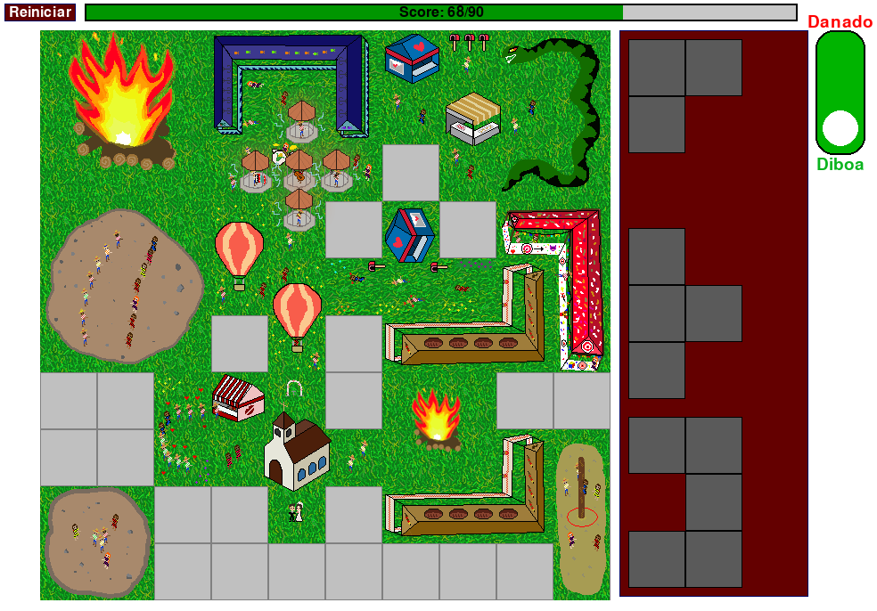

# 🔥🌽 Arraiápolis 🪗🐍


## 🎯 Evento: Game JamNina 2025

Jogo desenvolvido durante a **Game JamNina 2025**, organizada pelo grupo de desenvolvedores de jogos da **Unicamp**, conhecido como **GAMUX**. 

🎯 **Tema da competição:** "Olha a cobra!"

📅 **Período da Jam:** 30/05/2025 até 01/06/2025

🌐 **Links relacionados:**

* [Website da GAMUX](https://gamuxunicamp.github.io/website/)
* [GAMUX no Itch.io](https://gamux.itch.io/)
* [Página oficial do evento](https://itch.io/jam/game-jamnina-2025)


## 🎮 Sobre o Jogo

**Arraiápolis** é um **jogo de puzzle estratégico**, onde o objetivo é encaixar peças de diferentes formatos em um tabuleiro para construir o **arraial mais bonito da cidade**! 🌽🎶

Mas atenção: as **cobras** 🐍 podem aparecer no meio da festa e reduzir sua pontuação se você não tomar cuidado.

Planeje bem seus movimentos, busque as melhores combinações e monte o **arraial mais colorido e animado da região**!

### 🕹️ Como Jogar:

* **Seleção de peças:** Use o **botão direito do mouse** para selecionar a peça desejada.
* **Posicionamento:** Após selecionar, **clique novamente** no tabuleiro para posicionar a peça.
* **Rotação:** Pressione a tecla **"R"** para rotacionar a peça antes de colocá-la.
* **Dificuldades:** É possível escolher diferentes níveis de dificuldade. Quanto maior a dificuldade, maior a margem de pontos possível!
* **Dicas de áudio:** Preste atenção nas **falas do narrador** — eles dão pistas valiosas sobre os **melhores bônus** e como maximizar sua pontuação.

### 🏷️ Tags:

2D, Arraial, Festa Junina, Country, Game Jam, Indie, Isometric, Pixel Art, Pygame


## 🖼️ Screenshots



## 🛠️ Tecnologias Utilizadas

* Linguagem: Python 3.12
* Framework: Pygame
* Arte: Krita (desenvolvimento gráfico)
* Áudio: Audacity (criação e edição de sons)


## 👥 Equipe de Desenvolvimento

* 🎨 **Maria Angélica:** Desenvolvimento e criação das artes
* 🎵 **Nícolas Hecker:** Desenvolvimento, criação das artes e elaboração do áudio

## 🚀 Como Jogar

### ✅ Versão Web (Recomendada)

Jogue diretamente no navegador pelo Itch.io:
👉 [arraipolis](https://salocinrevenge.itch.io/arraipolis)

### ✅ Versão Local

Se preferir rodar na sua máquina:

1. Clone este repositório.
2. Instale as dependências:

```bash
pip install pygame
```

3. Execute o jogo:

```bash
python main.py
```

## 📄 Licença

Este jogo foi desenvolvido unicamente para fins educacionais e recreativos durante a **Game JamNina 2025**. 

Distribuído sob a licença [GNU General Public License (GPL)](LICENSE).

#### 🔗 Jogue online e confira outros projetos: [salocinrevenge.itch.io](https://salocinrevenge.itch.io/) 
